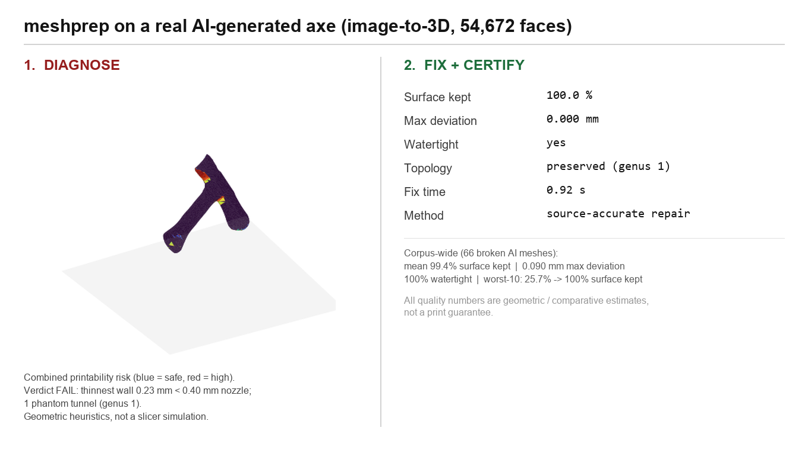
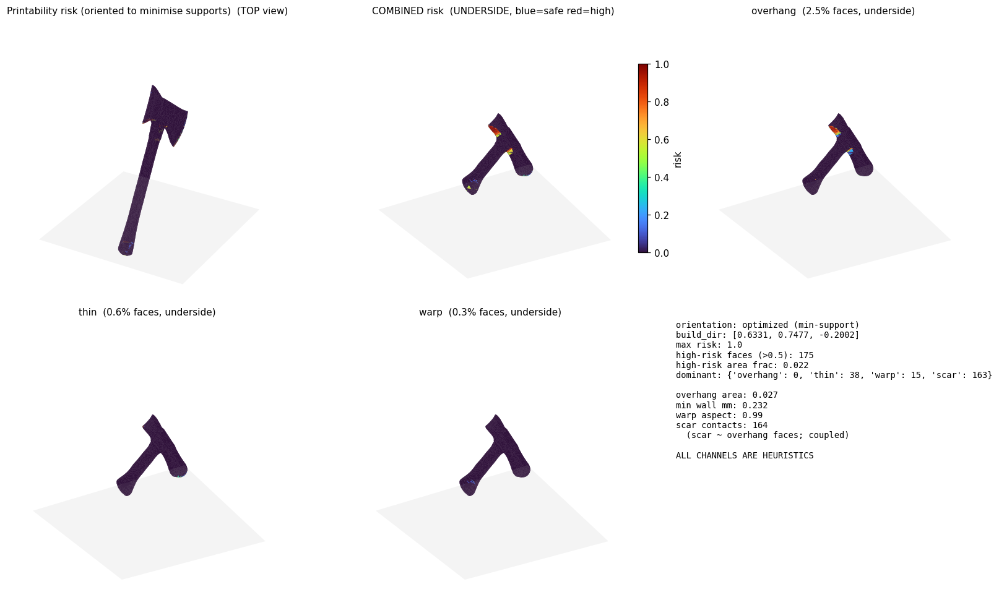
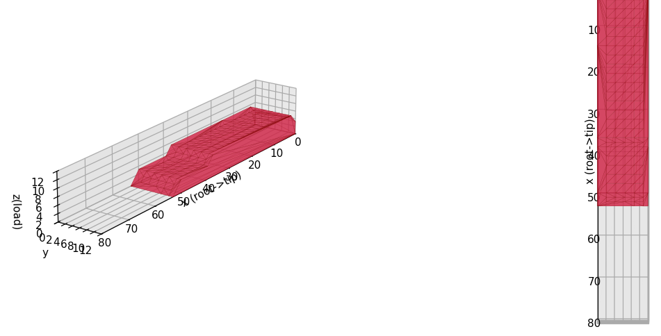
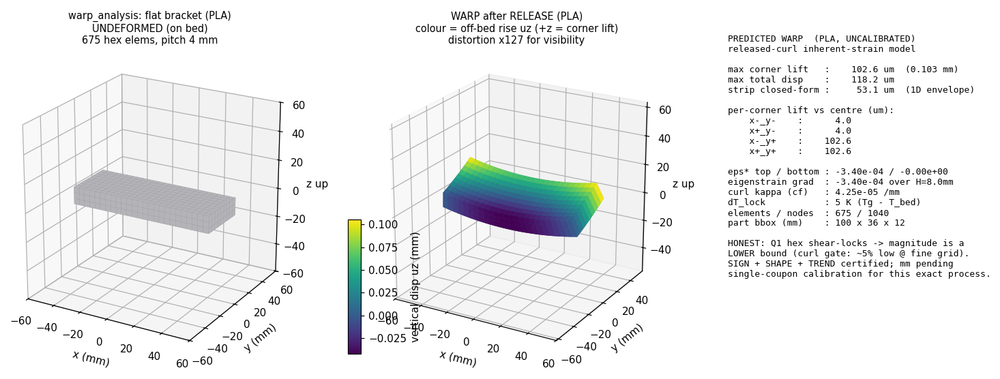
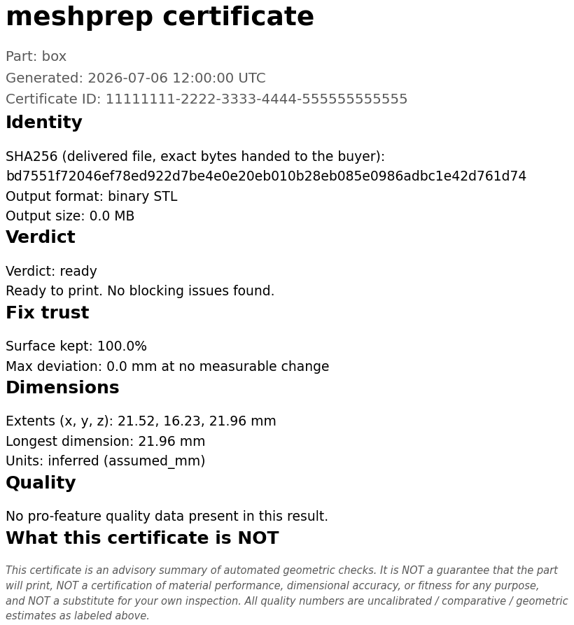
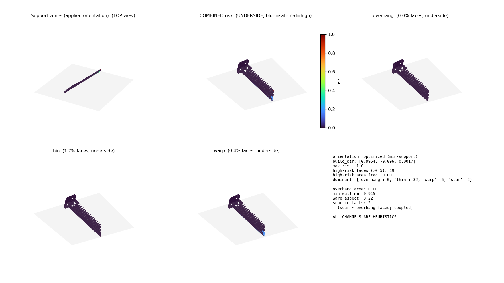
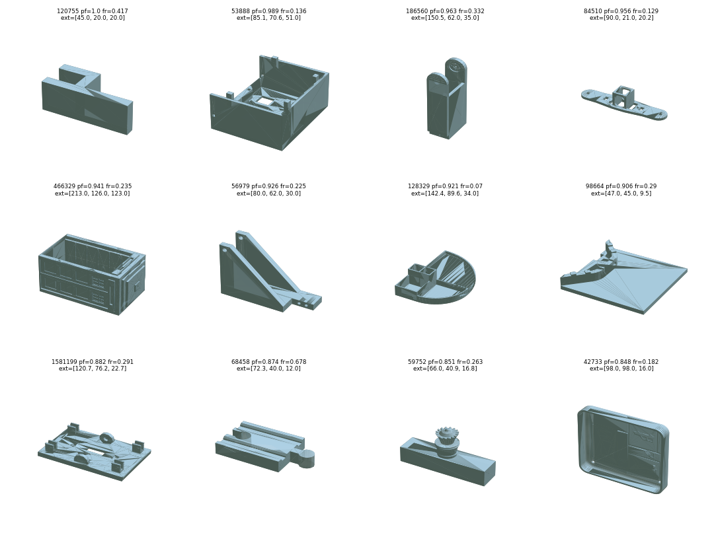

# meshprep

> **Drop a mesh, get a print-ready package — or a plain-English explanation of why not.**
> Permissive, geometric/FEM-based, honest about its limits. Not a slicer, not artist-grade,
> not a hosted service.

`meshprep` takes a messy triangle mesh (from Meshy/Tripo/Rodin/Hunyuan, a phone scan, a
CAD export) and runs the whole prep in one call: printability check → source-accurate
repair (with a deviation certificate) → build orientation → warp/strength physics →
graded-infill 3MF where it actually helps → a plain-language report. Every stage is
validated against closed-form solutions, controls, or independent validators — and every
output says plainly what it does and does **not** certify. It never crashes on bad input
and never reports success over a non-printable result — verified across a 143-cell matrix
of pathological inputs (every entry point × empty/NaN/inside-out/oversize/corrupt/non-mesh/
real-broken-AI files): 141/141 product cells clean, the only 2 failures being deliberately
planted tripwires that prove detection works. See `FOOLPROOF_REPORT.md`.

> ℹ️ Name status: `meshprep` verified **available on PyPI** (2026-07-03). Trademark
> clearance not yet done — do it before the first public release. See `RELEASE_MANIFEST.md`.

## See it

**Diagnose → source-accurate fix, on a real AI-generated mesh.** A 54,672-face axe from an
image-to-3D model: the risk heatmap flags the blocking issue, then the fix keeps the surface
verbatim and certifies exactly what changed.



*Corpus-wide across 66 broken AI meshes: mean **99.4 % of the surface kept**, **0.090 mm**
mean max-deviation, **100 % watertight**, worst-10 went 25.7 % → 100 % surface kept
(`ADJUSTMENT_REPORT.md`). Numbers are geometric/comparative estimates, not a print guarantee.*

**Printability risk heatmap** — geometric heuristics (45° overhang + Shape-Diameter thin-wall
+ warp + support-scar), oriented to minimise supports. Not a slicer simulation.



**Graded infill / reinforce** — the FEM load path drives a dense-core modifier where stress
concentrates (red), plain infill elsewhere; exported as a slicer-ready 3MF. Here mean von
Mises in the reinforced core is **6.64** vs **3.41** in a random-placement control
(*relative/comparative, uncalibrated* importance field — not a certified safety margin).



**Warp prediction** — inherent-strain FEM (reproduces the Timoshenko bimetal closed form
under refinement). Flat PLA bracket, predicted **0.103 mm** corner lift, distortion ×127 for
visibility. Labeled **UNCALIBRATED** — a lower bound until the one-coupon calibration.



**Fix certificate** — every fix ships an auditable summary: delivered-file SHA-256, surface
kept %, max deviation, dimensions, and an explicit "what this certificate is **NOT**" block.



**Risk-driven supports** — the premortem risk field places **SupportEnforcer** volumes only
where risk is real (schema-verified against PrusaSlicer; slicing effect MEASURED, not
asserted — a real overhang gained **+1.27 cm³ / +42.5 %** support material with auto-detect
off, `S2_FEATURES_REPORT.md`).



**What it handles** — a slice of the real test corpus (AI image-to-3D + CAD parts) that the
pipeline runs end-to-end; `pf` = printability fraction, `fr` = high-risk area fraction.



## One command, one call

| Entry | Does | Honest scope |
|---|---|---|
| **`meshprep prep part.glb`** | The full pipeline: verdict + repair + orient + physics + graded 3MF + report, packaged into an output folder. | Physics estimates are labeled uncalibrated until you run the one-coupon calibration. |
| **`meshprep check part.glb`** | Analysis only — **PASS / WARN / FAIL** with the reason, *where*, and the fix. Nothing is modified. | Geometric heuristics + a real (uncalibrated) warp FEM. Advisory, not a slicer. |
| **`meshprep fix part.glb`** | The source-accurate repair alone (before→after, ~100 % of the surface kept verbatim, max-deviation certificate). | Fidelity is measured, not assumed; garbage topology gets an honest refusal, not a mangled "fix". |
| **`meshprep reinforce bracket.stl`** | Mesh + load case → slicer-ready **3MF with graded infill** (dense on the FEM load path). PrusaSlicer/Orca/Bambu print it as-is. Includes a gradient pre-screen that tells you when plain uniform infill is the better deal. | Importance field is *relative* load (uncalibrated), not a certified safety margin. |
| **`meshprep calibrate`** | One printed coupon → a per-printer/filament scale that turns warp estimates into calibrated millimetres. | One scalar per (printer, filament, profile). |
| **`meshprep app`** | The same pipeline as a local drag-and-drop web app (Gradio). | Local only; nothing is uploaded anywhere. |

> The **auto-rig** tool (static mesh → posable glTF-2.0 rig) ships as a separate package —
> it is not part of `meshprep`.

Under them sits a **reduced-order FEM for 3D printing** (`scikit-fem` + `pyamg`): an
inherent-strain **warp** predictor (reproduces the Timoshenko bimetal closed form under
refinement) and an orthotropic **strength / orient-for-strength** channel — with a
one-coupon **calibration** that turns the uncalibrated estimate into a certified millimetre
for your exact printer + filament.

## Honest framing (read this)

- **Permissive only.** Every runtime dependency is MIT / BSD / Apache / MPL-2 (see
  `THIRD_PARTY_NOTICES.md`). No GPL, no copyleft, no proprietary/non-commercial code. A
  bundled `license_guard.py` scans the source and *proves* it.
- **Geometric / FEM, not learned.** No ML model, no training, no GPU required. The FEM
  solver is certified against closed forms; the print *predictions* on top are physics-based
  **estimates** (right sign/shape/trend + order of magnitude), not certified numbers until
  you run the coupon calibration.
- **"Watertight" ≠ "genus-correct"**; verdicts are advisory triage.
- **One unwalked gate per tool:** the headless validation is strong (closed forms, controls,
  a real PrusaSlicer CLI in the loop), but the *physical* confirmation is yours — print one
  warp coupon, load one graded bracket.
- **Not a venture product.** This is a free, open, credibility/utility release. The ML
  rigging platforms own the production-rig market; the slicer/CAD incumbents own
  optimization. `meshprep` fills the lightweight-permissive-geometric gap they leave.

## Install

```bash
pip install meshprep                # core (permissive only)
pip install "meshprep[fast]"        # + faster decimation
# retopo-pyqf extra is LGPL-flagged — read THIRD_PARTY_NOTICES.md first
```

## Quickstart

```bash
# the whole pipeline in one shot -> output folder with prep.stl + report + renders
meshprep prep mypart.glb

# check only (nothing modified): verdict + the one reason + where + the fix
meshprep check mypart.glb

# graded-infill 3MF for a loaded part (open the .3mf in PrusaSlicer)
meshprep reinforce bracket.stl -o reinforced.3mf --load-axis 2 --force 200 \
    --tiers "55:50:mid,85:100:core"

# local drag-and-drop web app
meshprep app
```

```python
import meshprep
result = meshprep.prep("mypart.glb", profile="generic_fdm", reinforce_load="z")
print(result["verdict"], "-", result["headline"])   # never raises
```

## Roadmap & feature status (each module carries its full build plan)

| Feature | Stub | One line |
|---|---|---|
| **Warp pre-compensation** | `core/warp_precomp.py` — stub here; **implemented in the separate pro package** | Invert the validated warp field: pre-deform the mesh so the print comes off the bed straight. The flagship. |
| **Risk-driven supports** | `core/support_mods.py` — **implemented** | Premortem risk field → schema-verified **SupportEnforcer / SupportBlocker** volumes (PrusaSlicer `Model.cpp`/`3mf.cpp`); the slicing effect (enforcer adds / blocker removes support material) is MEASURED via a CLI proof, not asserted — `meshprep prep --supports` CLI wiring not yet landed, call `support_mods()` directly. |
| **Stress-mapped multi-material** | `core/multimaterial.py` — stub here; **implemented in the separate pro package** (real T0/T1 tool changes measured in gcode) | The reinforce field assigns **extruders**: rigid on the load path, soft/cheap elsewhere. |
| **Smart split + connectors** | `split.py` (`plan_seams`, `plan_connectors`) — **implemented** | Seams scored (concavity/load/area) into concave creases (EI neck-cut) or CoACD interfaces, exact `manifold3d` boolean cut with a labeled fallback ladder, peg/socket connectors + fit coupon — opt-in via `split_for_bed(mesh, profile, smart=True)`. |
| **Instant print quotes** | `quote.py` — stub here; **implemented in the separate pro package** (byte-reproducible quote body; refuses without a rate card) | Bureau intake: verdict + fix certificate + reproducible cost quote, single file or batch. |

Rows marked **implemented** are real, verified features in this package. The remaining
public stubs are callable and return an honest `{"ok": False, "implemented": False, note}`
— nothing pretends to work before it does. Pro-package rows are proprietary
implementations sold separately; their public stubs (with full build plans) stay here in
good faith.

## Status

Alpha / staging. The code is built and validated; this repository is the **clean OSS
perimeter** (license, notices, packaging, GPL guard). The source modules are vendored per
`RELEASE_MANIFEST.md`. See `CHANGELOG.md`.

## License

MIT — see `LICENSE`. Third-party components: `THIRD_PARTY_NOTICES.md`.
